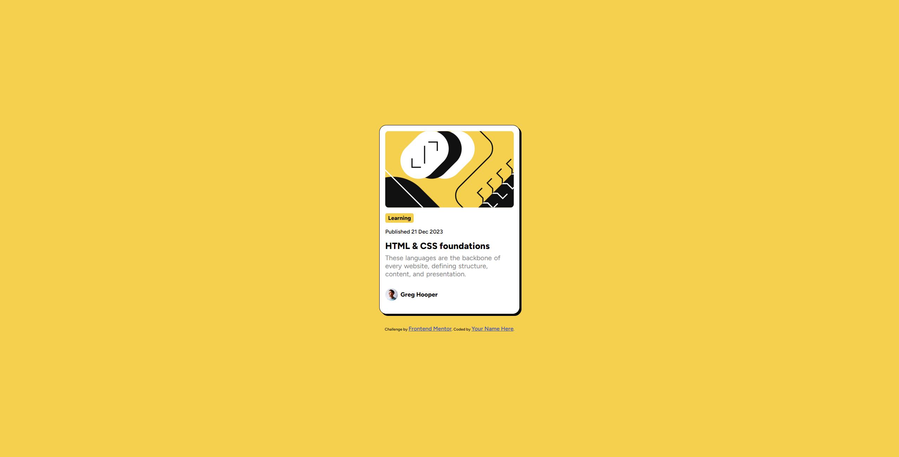

# Frontend Mentor - Blog preview card solution

This is a solution to the [Blog preview card challenge on Frontend Mentor](https://www.frontendmentor.io/challenges/blog-preview-card-ckPaj01IcS). Frontend Mentor challenges help you improve your coding skills by building realistic projects. 

## Table of contents

- [Overview](#overview)
  - [The challenge](#the-challenge)
  - [Screenshot](#screenshot)
  - [Links](#links)
- [My process](#my-process)
  - [Built with](#built-with)
  - [What I learned](#what-i-learned)
  - [Continued development](#continued-development)
  - [Useful resources](#useful-resources)
- [Author](#author)

## Overview

### The challenge

Users should be able to:

- See hover and focus states for all interactive elements on the page

### Screenshot



### Links

- Solution URL: [My Solution](https://github.com/Harrison-Jolly/blog-preview-card-main)
- Live Site URL: [My Live Site](https://gentle-torte-ec6d32.netlify.app)

### Built with

- Semantic HTML5 markup
- CSS custom properties
- Flexbox
- Mobile-first workflow

### What I learned

This was my first time using some newer responsive css functions I've come across such as `clamp()` and `cqi`.

I used `clamp()` for the card width and font sizes so that when the viewport gets close to 375px both the card and font sizes shrink a little bit but stop shrinking once the viewport is 375px or less. I could have used media queries but I thought this was a nice extra challenge :)

Below are some examples of how I used clamp to make the elements/font sizes responsive without using media queries:

```css
.card {
  width: clamp(337.5px, 25rem, 90%);
}

.type h2 {
  font-size: clamp(0.8rem, -0.2870rem + 4.6377vw, 1rem);
}
```

Through trial and error I've managed to get the fonts to shrink at roughly the same rate.

### Continued development

I think being able to make websites more responsive without the use of media queries would be a good tool to have in my tool box so I'll be trying to use these functions more often.

I also think it makes the code cleaner by not having media querier but not neccessarily more readable.

### Useful resources

- [Clamp font size calculator](https://css-tricks.com/linearly-scale-font-size-with-css-clamp-based-on-the-viewport/) - Halfway down this webpage is a calculator for finding the correct clamp font sizes values you need. Very useful.
- [Min(), Max(), Clamp()](https://youtu.be/U9VF-4euyRo?si=TDrp2ZBZIX2-Vw4F) - This is a good video from Kevin Powell that helped me understand how each of the functions are used.

## Author

- Frontend Mentor - [Harrison-Jolly](https://www.frontendmentor.io/profile/Harrison-Jolly)
- LinkedIn - [Harrison-Jolly](www.linkedin.com/in/harrison-jolly-0886a9260)
